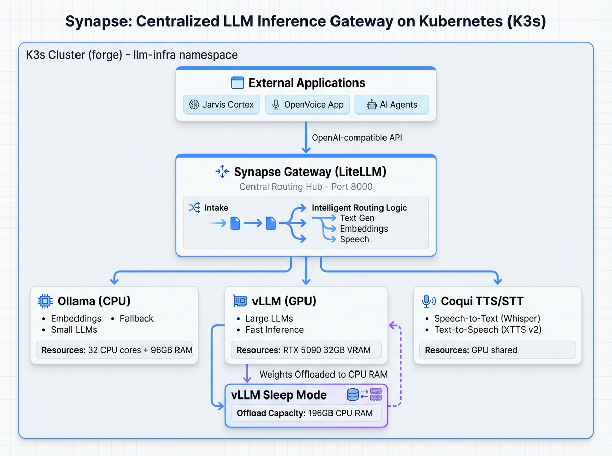

<p align="center">
  
</p>

<h1 align="center">Synapse</h1>

<p align="center">
  <strong>Unified AI Gateway — TTS, STT, Speaker Analysis, Audio Processing, and Embeddings through a single endpoint</strong>
</p>

<p align="center">
  <a href="LICENSE"></a>
  <a href="https://kubernetes.io"></a>
  <a href="https://fastapi.tiangolo.com"></a>
  <a href="https://www.python.org"></a>
</p>

---

## What is Synapse?

Synapse is a **custom FastAPI gateway** (~1,500 lines) that provides a single endpoint for all AI services running on an on-prem K3s cluster. Instead of managing separate APIs for text-to-speech, speech-to-text, speaker analysis, audio processing, and embeddings, Synapse routes every request to the right backend through one unified URL: `https://synapse.arunlabs.com`.

The gateway handles voice library management (storing reference WAV samples on a PVC for zero-shot voice cloning), circuit breakers per backend, health aggregation, and request proxying — all without third-party gateway dependencies. Configuration is a single `backends.yaml` file that maps routes to backend URLs.

All 5 backends and 17 endpoints are deployed and verified end-to-end.

## Features

- **Zero-shot voice cloning** — Upload a 6-second WAV sample to clone any voice via Chatterbox Turbo (350M params)
- **23 languages** — TTS supports en, de, es, fr, hi, it, ja, ko, nl, pl, pt, ru, tr, zh, ar, cs, da, fi, hu, nb, ro, sv, uk
- **Speech-to-text with word timestamps** — faster-whisper with Whisper large-v3-turbo (int8 quantized)
- **Streaming transcription** — Server-Sent Events for real-time STT segment delivery
- **Speaker diarization** — Identify who spoke when with pyannote.audio 3.1
- **Speaker verification** — Compare two audio samples to confirm speaker identity
- **Audio denoising** — Background noise removal via DeepFilterNet3
- **Format conversion** — WAV, MP3, FLAC, OGG conversion via ffmpeg
- **Embeddings** — snowflake-arctic-embed2 via llama-embed (1024 dimensions)
- **Circuit breakers** — Per-backend failure isolation (5 failures = 30s cooldown)
- **Health aggregation** — Single `/health` endpoint reports status of all backends
- **Voice library** — PVC-backed voice reference storage with upload, list, and delete
- **Simple configuration** — One `backends.yaml` file maps routes to backend URLs

## Architecture

```
┌──────────────────────────────────────┐
│  Clients                             │
│  (Voice agents, Apps, curl)          │
└──────────────────┬───────────────────┘
                   │ HTTPS
┌──────────────────▼───────────────────┐
│  Synapse Gateway (FastAPI, port 8000)│
│  Routing · Circuit Breakers · Voices │
└──┬──────┬──────┬──────┬──────┬───────┘
   │      │      │      │      │
┌──▼──┐┌──▼──┐┌──▼──┐┌──▼──┐┌──▼──┐
│Embed││ TTS ││ STT ││Spkr ││Audio│
│     ││     ││     ││     ││     │
│llama││Chat-││whis-││pyan-││Deep-│
│embed││ box ││ per ││note ││Fltr │
└─────┘└─────┘└─────┘└─────┘└─────┘
```

| Component            | Role                                               | Model                         | Device |
| -------------------- | -------------------------------------------------- | ----------------------------- | ------ |
| **Synapse Gateway**  | Request routing, voice library, health aggregation | —                             | CPU    |
| **llama-embed**      | Text embeddings (1024 dims)                        | snowflake-arctic-embed2       | CPU    |
| **Chatterbox TTS**   | Text-to-speech, voice cloning                      | Chatterbox Turbo (350M)       | CPU    |
| **whisper-stt**      | Speech-to-text, language detection                 | Whisper large-v3-turbo (int8) | CPU    |
| **pyannote-speaker** | Speaker diarization + verification                 | pyannote 3.1                  | CPU    |
| **deepfilter-audio** | Noise reduction + format conversion                | DeepFilterNet3 + ffmpeg       | CPU    |

> **Note:** All backends currently run on CPU. The RTX 5090 (Blackwell, sm_120) is not yet supported by stable PyTorch. Once sm_120 kernels ship, Chatterbox will move to GPU.

## Quick Start

### Health Check

```bash
curl https://synapse.arunlabs.com/health
```

> **Tip:** Visit `https://synapse.arunlabs.com/docs` for interactive API documentation (Swagger UI), or `https://synapse.arunlabs.com/dashboard` for a live status dashboard.

### Text-to-Speech

```bash
curl -X POST https://synapse.arunlabs.com/tts/synthesize \
  -H "Content-Type: application/json" \
  -d '{"text": "Hello from Synapse", "language": "en"}' \
  --output speech.wav
```

### Voice Cloning

```bash
# 1. Upload a voice reference (WAV, minimum 6 seconds of speech)
curl -X POST https://synapse.arunlabs.com/voices \
  -F "name=narrator" \
  -F "files=@sample.wav"
# Returns: {"voice_id": "a1b2c3d4-...", ...}

# 2. Synthesize with the cloned voice
curl -X POST https://synapse.arunlabs.com/tts/synthesize \
  -H "Content-Type: application/json" \
  -d '{"text": "Hello from Synapse", "voice_id": "a1b2c3d4-...", "language": "en"}' \
  --output cloned.wav
```

### Speech-to-Text

```bash
curl -X POST https://synapse.arunlabs.com/stt/transcribe \
  -F "file=@recording.wav" \
  -F "language=en" \
  -F "word_timestamps=true"
```

### Speaker Diarization

```bash
curl -X POST https://synapse.arunlabs.com/speakers/diarize \
  -F "file=@meeting.wav" \
  -F "min_speakers=2" \
  -F "max_speakers=5"
```

### Speaker Verification

```bash
curl -X POST https://synapse.arunlabs.com/speakers/verify \
  -F "file1=@sample_a.wav" \
  -F "file2=@sample_b.wav"
```

### Audio Denoising

```bash
curl -X POST https://synapse.arunlabs.com/audio/denoise \
  -F "file=@noisy.wav" \
  --output clean.wav
```

### Embeddings

```bash
curl -X POST https://synapse.arunlabs.com/v1/embeddings \
  -H "Content-Type: application/json" \
  -d '{"model": "snowflake-arctic-embed2:latest", "input": "test text"}'
```

## API Reference

All 17 endpoints:

| Method   | Path                      | Description                                     | Backend          |
| -------- | ------------------------- | ----------------------------------------------- | ---------------- |
| `GET`    | `/health`                 | Aggregated health of all backends               | Gateway          |
| `GET`    | `/voices`                 | List all voices in library                      | Gateway (local)  |
| `POST`   | `/voices`                 | Upload voice reference samples                  | Gateway (local)  |
| `POST`   | `/voices/{id}/references` | Add references to existing voice                | Gateway (local)  |
| `DELETE` | `/voices/{id}`            | Delete a voice                                  | Gateway (local)  |
| `POST`   | `/tts/synthesize`         | Synthesize speech (with optional voice cloning) | Chatterbox TTS   |
| `POST`   | `/tts/stream`             | Stream TTS audio                                | Chatterbox TTS   |
| `POST`   | `/tts/interpolate`        | Blend multiple voices and synthesize            | Chatterbox TTS   |
| `GET`    | `/tts/languages`          | List supported TTS languages                    | Gateway (static) |
| `POST`   | `/stt/transcribe`         | Full audio transcription                        | whisper-stt      |
| `POST`   | `/stt/detect-language`    | Detect spoken language                          | whisper-stt      |
| `POST`   | `/stt/stream`             | Stream transcription segments (SSE)             | whisper-stt      |
| `POST`   | `/speakers/diarize`       | Speaker diarization (who spoke when)            | pyannote-speaker |
| `POST`   | `/speakers/verify`        | Speaker verification (same person?)             | pyannote-speaker |
| `POST`   | `/audio/denoise`          | Remove background noise                         | deepfilter-audio |
| `POST`   | `/audio/convert`          | Convert audio format                            | deepfilter-audio |
| `POST`   | `/v1/embeddings`          | Generate text embeddings                        | llama-embed      |

See the [API Reference](docs/API.md) for full request/response schemas, error codes, and code examples, or the [Integration Guide](docs/INTEGRATION-GUIDE.md) for end-to-end workflows.

## Configuration

The gateway reads `config/backends.yaml` — a simple YAML registry that maps URL patterns to backend services. Each backend entry specifies its cluster URL, type, and health endpoint.

| Variable                      | Default                 | Description                       |
| ----------------------------- | ----------------------- | --------------------------------- |
| `SYNAPSE_GATEWAY_CONFIG_PATH` | `/config/backends.yaml` | Path to backend registry          |
| `SYNAPSE_VOICE_LIBRARY_DIR`   | `/data/voices`          | Voice reference storage directory |
| `SYNAPSE_LOG_LEVEL`           | `INFO`                  | Logging level                     |

See the [API Reference](docs/API.md#configuration) for the full configuration schema and backend registry format.

## Deployment

Synapse deploys to a K3s cluster in the `llm-infra` namespace. Images are pushed to `registry.arunlabs.com`.

### Makefile Targets

| Target                | Description                                          |
| --------------------- | ---------------------------------------------------- |
| `make deploy`         | Deploy all services (infra + all backends + gateway) |
| `make deploy-phase1`  | Deploy gateway + embeddings + TTS only               |
| `make deploy-stt`     | Deploy whisper-stt backend                           |
| `make deploy-speaker` | Deploy pyannote-speaker backend                      |
| `make deploy-audio`   | Deploy deepfilter-audio backend                      |
| `make build-gateway`  | Build and push gateway image                         |
| `make test-health`    | Health check all services                            |
| `make test-tts`       | Test TTS synthesis endpoint                          |
| `make show-routes`    | Display all registered routes                        |
| `make logs`           | Tail logs from all services                          |
| `make status`         | Show all pods in namespace                           |
| `make validate`       | Dry-run validate all manifests                       |
| `make clean`          | Remove all Synapse resources (destructive)           |

## Project Structure

```
synapse/
├── gateway/                  # Custom FastAPI gateway
│   ├── src/
│   │   ├── main.py           # App entrypoint, health aggregation
│   │   ├── config.py         # backends.yaml loader
│   │   ├── backend_client.py # HTTP client with circuit breaker + retries
│   │   ├── models.py         # Pydantic request/response models
│   │   ├── voice_manager.py  # Voice library CRUD (PVC-backed)
│   │   ├── router_tts.py     # TTS routes (Chatterbox two-step proxy)
│   │   ├── router_stt.py     # STT routes (faster-whisper proxy)
│   │   ├── router_speaker.py # Speaker routes (pyannote proxy)
│   │   ├── router_audio.py   # Audio routes (DeepFilterNet proxy)
│   │   └── router_llm.py     # Embeddings route (llama-embed proxy)
│   ├── Dockerfile            # python:3.11-slim, no ML dependencies
│   └── requirements.txt
├── config/
│   └── backends.yaml         # Backend registry + route mapping
├── manifests/
│   ├── infra/                # Namespace, PVCs, ingress
│   └── apps/                 # Deployment + Service for each backend
├── scripts/                  # Health checks, test helpers
├── docs/
│   ├── API.md                   # Full API reference (17 endpoints)
│   ├── INTEGRATION-GUIDE.md     # Workflow-oriented integration guide
│   ├── synapse-architecture.png # Architecture diagram
│   ├── tts-request-flow.png     # Voice cloning flow diagram
│   ├── api-route-map.png        # API endpoints visual map
│   └── archive/                 # Legacy docs (BUILD-PLAN, DEPLOYMENT, etc.)
├── Makefile
└── LICENSE
```

## Documentation

- **[API Reference](docs/API.md)** — Full endpoint specs, request/response schemas, error codes, and code examples
- **[Integration Guide](docs/INTEGRATION-GUIDE.md)** — End-to-end workflows: voice cloning, meeting transcription, speaker verification
- **[Interactive API Docs](https://synapse.arunlabs.com/docs)** — Swagger UI (live, auto-generated from code)
- **[Status Dashboard](https://synapse.arunlabs.com/dashboard)** — Live backend health and service status
- **[Architecture Diagram](docs/synapse-architecture.png)** — Visual overview of gateway and backends

## License

[MIT](LICENSE)
