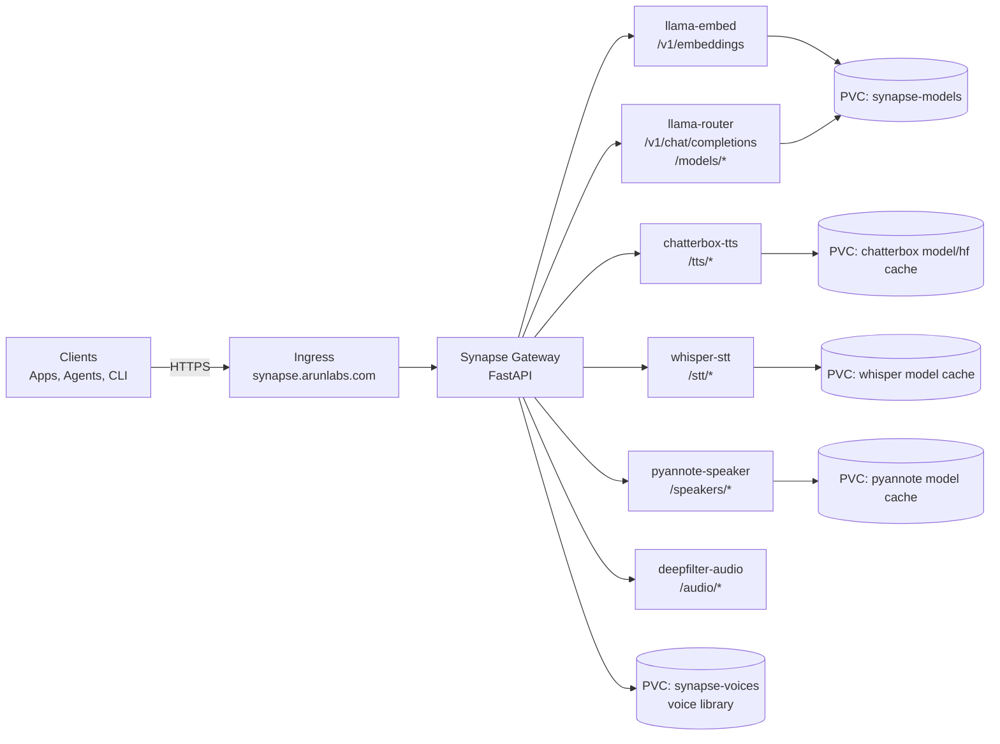
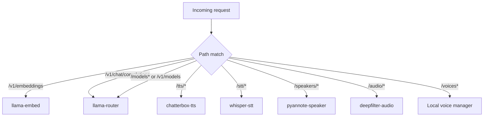
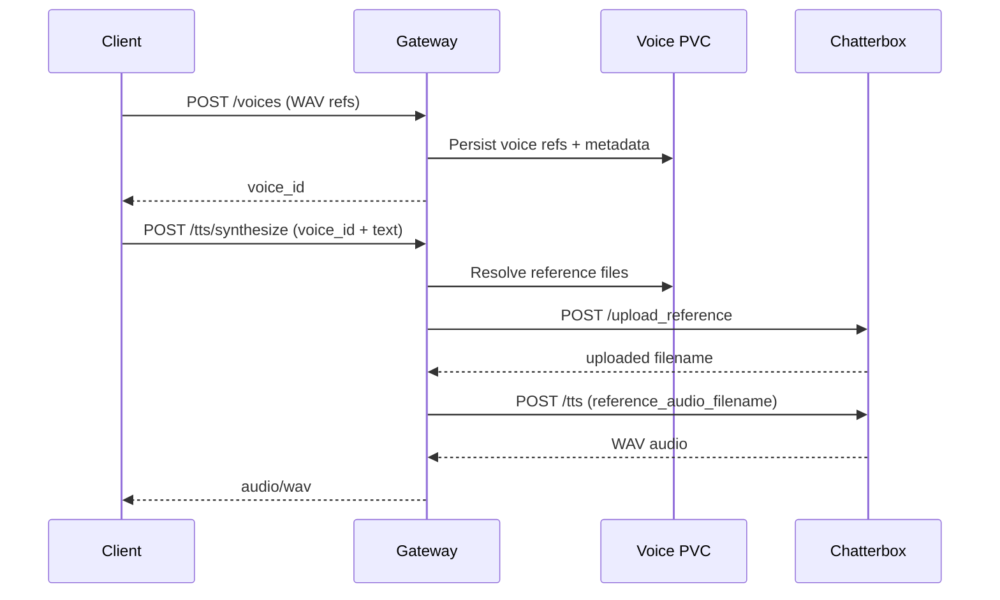

# Synapse Architecture

Synapse is a single FastAPI gateway that fronts LLM, TTS, STT, speaker-analysis, and audio-processing backends running in Kubernetes.

## System Topology

## Request Routing

## Voice Cloning Flow

## Reliability Controls

- Per-backend circuit breaker: opens after 5 connection failures, cools down for 30 seconds.
- Request retries (connection errors only): 0.5s, 1s, 2s backoff.
- Timeout profiles by backend type (`llm`, `tts`, `stt`, `speaker`, `audio`, `embeddings`).

## Runtime Entry Points

- API docs: `GET /docs`
- Health: `GET /health`
- Dashboard UI: `GET /`, `GET /ui`, `GET /dashboard`
